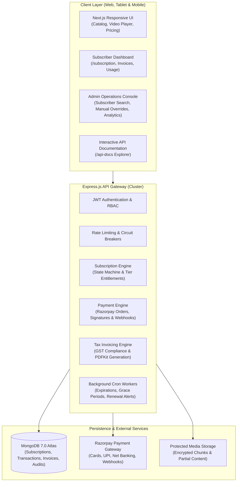

# Enterprise Video Streaming & Comprehensive Subscription Management Platform

Enterprise-grade, secure full-stack video streaming, learning platform, and digital subscription ecosystem built with **Next.js 16 (React 19, TypeScript, Tailwind CSS)**, **Node.js Express**, **MongoDB Atlas**, **Razorpay Payments**, and **LiveKit WebRTC**.

The platform is hardened across **all 12 comprehensive development phases**, implementing end-to-end subscription lifecycle orchestration, tiered entitlement gating, PCI-DSS compliant payment processing, GST tax compliance, automated PDF invoicing, abuse mitigation, back-office administration, and real-time revenue analytics.

---

## 🏗️ High-Level System Architecture



---

## 🌟 Subscription Tier Matrix & Entitlements

| Feature / Benefit | Free Tier | Bronze Tier | Silver Tier | Gold Tier |
| :--- | :---: | :---: | :---: | :---: |
| **Pricing (Monthly)** | ₹0 | ₹199 / mo | ₹499 / mo | ₹999 / mo |
| **Pricing (Quarterly - 10% off)** | ₹0 | ₹537 | ₹1,347 | ₹2,697 |
| **Pricing (Yearly - 20% off)** | ₹0 | ₹1,910 | ₹4,790 | ₹9,590 |
| **Streaming Quality** | 360p / 480p | 720p HD | 1080p Full HD | 4K Ultra HD + HDR |
| **Daily Offline Downloads**| 1 video / day | 5 videos / day | 15 videos / day | 50 videos / day |
| **Daily Watch Time** | 60 minutes | Unlimited | Unlimited | Unlimited |
| **Allowed Concurrent Devices**| 1 device | 2 devices | 3 devices | 5 devices |
| **Ad Experience** | Standard Ads | Reduced Ads | Zero Ads | Zero Ads |
| **Premium Video Access** | Standard only | Standard only | Full Access | Full Access |
| **Official GST Tax Invoice**| N/A | Included | Included | Included |

---

## 🚀 Completed Engineering Phases (1–12)

1. **Phase 1 — Subscription Foundation**: MongoDB schema, 4 tier definitions, feature matrix, transaction architecture.
2. **Phase 2 — Feature Access & Permissions**: Plan-based route protection, 1080p/4K resolution gating, watch time trackers.
3. **Phase 3 — Pricing & Plan Comparison**: Interactive `/pricing` page, monthly/quarterly/yearly toggles with 10% & 20% discounts.
4. **Phase 4 — Subscription Dashboard**: Self-service portal (`/subscription`), quota progress bars, renewal management.
5. **Phase 5 — Payment Gateway Integration**: Razorpay API, server-side order generation, HMAC-SHA256 signature verification.
6. **Phase 6 — Invoicing & Billing**: GST compliance (18% SAC 998439), dynamic PDF invoice generation via PDFKit.
7. **Phase 7 — Lifecycle Management**: Finite state machine (`active`, `cancel_scheduled`, `grace_period`, `expired`), background cron jobs.
8. **Phase 8 — Webhooks & Idempotency**: Asynchronous Razorpay webhook processing with cryptographic event deduplication.
9. **Phase 9 — Admin Operations & Analytics**: Back-office subscriber management, manual validity extensions, suspension, MRR / churn KPIs.
10. **Phase 10 — Security, Fraud & Abuse**: Cryptographic signature validation, rate limiters, token replay protection, velocity checks.
11. **Phase 11 — Testing, Optimization & CI/CD**: Master automated test runner (206/206 assertions passed), compound database indexing.
12. **Phase 12 — Final System Integration & Project Completion**: Master 20-stage E2E suite (`test:e2e`), interactive `/api-docs` explorer, 20-document operational documentation suite.

---

## 🧪 Verification & Test Execution

```bash
# 1. Run Master Phase 12 End-to-End Integration Suite (20/20 stages)
npm run test:e2e

# 2. Run Master Phase 11 Automated Testing Suite (206/206 assertions)
npm run test:phase11

# 3. Run All Phases Concurrently
npm run test:all:phases

# 4. Run Pre-Deployment Readiness Check (10/10 operational checks)
npm run check:readiness

# 5. Run Post-Deployment Verification
node server/scripts/postDeploymentValidation.js

# 6. Run Next.js Production Build
npm run build
```

---

## 📚 Complete Documentation Suite (`docs/`)

Explore the comprehensive operational manuals and engineering specifications:

| Guide | Description |
| :--- | :--- |
| [USER_GUIDE.md](docs/USER_GUIDE.md) | End-user subscription guide, plan discovery, checkout, and self-service. |
| [SUBSCRIPTION_GUIDE.md](docs/SUBSCRIPTION_GUIDE.md) | Comprehensive subscription lifecycle, state machine, and background crons. |
| [PAYMENT_GUIDE.md](docs/PAYMENT_GUIDE.md) | Razorpay payment flow, test credentials, webhook lifecycle, and refunds. |
| [BILLING_GUIDE.md](docs/BILLING_GUIDE.md) | Invoicing engine, Indian GST tax calculations, and PDF generation. |
| [ADMIN_GUIDE.md](docs/ADMIN_GUIDE.md) | Back-office subscriber management, audit trail requirements, and overrides. |
| [SYSTEM_ADMIN_GUIDE.md](docs/SYSTEM_ADMIN_GUIDE.md) | Infrastructure topology, PM2 cluster mode, scaling, and database indexes. |
| [DEVELOPER_GUIDE.md](docs/DEVELOPER_GUIDE.md) | Architectural patterns, adding new plans, and middleware usage. |
| [API_DOCUMENTATION.md](docs/API_DOCUMENTATION.md) | Exhaustive REST endpoint specifications and request/response payloads. |
| [DATABASE_DOCUMENTATION.md](docs/DATABASE_DOCUMENTATION.md) | MongoDB schemas, field constraints, compound indexes, and retention rules. |
| [ENV_REFERENCE.md](docs/ENV_REFERENCE.md) | Environment variable definitions, defaults, and secrets management. |
| [TROUBLESHOOTING.md](docs/TROUBLESHOOTING.md) | Known error codes, diagnostic recipes, and recovery procedures. |
| [MAINTENANCE.md](docs/MAINTENANCE.md) | Scheduled cron tasks, log rotation, database hygiene, and health probes. |
| [DISASTER_RECOVERY.md](docs/DISASTER_RECOVERY.md) | RTO/RPO objectives, backup strategies, and point-in-time recovery SOPs. |
| [DEPLOYMENT_GUIDE.md](docs/DEPLOYMENT_GUIDE.md) | Production Docker containers, NGINX SSL config, and zero-downtime cutover. |
| [PRODUCTION_CHECKLIST.md](docs/PRODUCTION_CHECKLIST.md) | Pre-launch checklist, security review, and operational verification gates. |
| [KNOWN_LIMITATIONS.md](docs/KNOWN_LIMITATIONS.md) | Architectural boundaries, trade-offs, and recommended operational workarounds. |
| [FUTURE_ROADMAP.md](docs/FUTURE_ROADMAP.md) | Strategic product roadmap: global multi-currency, family plans, creator monetization. |
| [SYSTEM_FLOW.md](docs/SYSTEM_FLOW.md) | Sequence diagrams covering end-to-end user journeys and data flows. |
| [PROJECT_REPORT.md](docs/PROJECT_REPORT.md) | Final executive summary of all 12 completed phases and system metrics. |

---

## ⚡ Quick Start

### 1. Clone & Configure
```bash
cp .env.example .env
# Populate DB_URL, JWT_SECRET, and RAZORPAY credentials
```

### 2. Install Dependencies
```bash
npm install
cd server && npm install && cd ..
```

### 3. Run in Development Mode
```bash
# Terminal 1: Start Express API Gateway
cd server && npm run dev

# Terminal 2: Start Next.js Frontend
npm run dev
```

Visit `http://localhost:3000` to access the platform or `http://localhost:3000/api-docs` to explore interactive API documentation.
