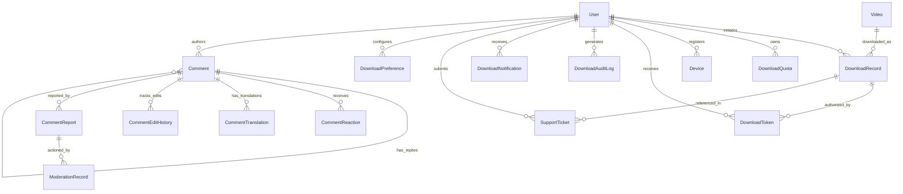

# System Architecture & Technical Specifications

This document outlines the complete architectural design, data flows, security boundaries, and scalability models of the video platform and controlled download management system.

---

## 1. High-Level Architecture Overview

The platform is architected as a modular, monolithic service with isolated domain services, strict ownership checks, and layered security controls:

```
                               ┌──────────────────────────────────────────────┐
                               │             NEXT.JS CLIENT (SSR/SPA)         │
                               │  - Video Browsing & Playback                 │
                               │  - User Download Center & Device Management  │
                               │  - Admin Dashboard, Analytics & Reporting    │
                               └──────────────────────┬───────────────────────┘
                                                      │ HTTPS / WSS
                                                      ▼
                               ┌──────────────────────────────────────────────┐
                               │           EXPRESS.JS BACKEND GATEWAY         │
                               │  - Helmet Security Headers & CORS Policy     │
                               │  - Rate Limiters & Request Correlation ID     │
                               │  - Centralized Error Handling & Diagnostics  │
                               │  - Probes: /health, /ready, /live            │
                               └──────────────────────┬───────────────────────┘
                                                      │
         ┌───────────────────┬────────────────────────┼────────────────────────┬───────────────────┐
         ▼                   ▼                        ▼                        ▼                   ▼
  ┌─────────────┐     ┌─────────────┐          ┌─────────────┐          ┌─────────────┐     ┌─────────────┐
  │ AUTH & USER │     │SUBSCRIPTION │          │ DOWNLOAD    │          │ DEVICE &    │     │ADMIN & AUDIT│
  │  SERVICES   │     │  SERVICES   │          │ ENGINE      │          │ SECURITY    │     │  SERVICES   │
  └──────┬──────┘     └──────┬──────┘          └──────┬──────┘          └──────┬──────┘     └──────┬──────┘
         │                   │                        │                        │                   │
         └───────────────────┴────────────────────────┼────────────────────────┴───────────────────┘
                                                      │
                                                      ▼
                               ┌──────────────────────────────────────────────┐
                               │              DATA ARCHITECTURE               │
                               │  - MongoDB Atlas (Replica Set / Indexes)     │
                               │  - Local / Cloud File Storage (Private/CDN)  │
                               └──────────────────────────────────────────────┘
```

---

## 2. Core Subsystems

### A. Authentication & User Management
* **Authentication**: Stateless JSON Web Tokens (JWT) signed via HMAC SHA-256.
* **Role-Based Access Control**: Distinguishes standard subscribers from administrative operators (`role: "admin"`).
* **Identity Management**: Google Firebase OAuth provider integrated with local MongoDB user synchronization.

### B. Subscription Plans & Entitlement Engine
* **Tier Configuration**: Authoritative plan definitions maintained server-side (`Free`, `Bronze`, `Silver`, `Gold`).
* **Entitlement Evaluation**: Checks user account standing, plan status, expiration dates, and grace periods dynamically.
* **Plan Synchronization**: Transitions quota allowances and device maximums immediately upon tier upgrades or downgrades.

### C. Download Authorization & Token Engine
* **Pre-Flight Validation**: Executes atomic pipeline checking Authentication $\to$ Subscription Validity $\to$ Video Availability $\to$ Quota Sufficiency $\to$ Device Restrictions $\to$ Duplicate Rules $\to$ Security Risk Scoring.
* **Cryptographic Tokens**: Single-use HMAC SHA-256 signatures binding User ID, Video ID, Device ID, and expiration timestamp.
* **Replay Protection**: Tokens are marked `is_used: true` upon stream initiation; subsequent attempts are rejected as `TOKEN_REPLAY_ATTEMPT`.

### D. Download Quota & Concurrency Engine
* **Atomic Deductions**: Utilizes MongoDB conditional operations (`findOneAndUpdate({ quota_used: { $lt: quota_limit } }, { $inc: { quota_used: 1 } })`) to eliminate race conditions under concurrent requests.
* **Multi-Cycle Resets**: Deterministic UTC calculations for daily, monthly, and billing cycle quota intervals.
* **Reservation Lifecycle**: Automatically releases reserved quota if storage streaming fails before completion.

### E. Duplicate Detection & Retry Engine
* **Reuse Window**: Identical video download requests within 24 hours reissue download tokens without deducting additional quota.
* **Failure Recovery**: Interrupted streams support HTTP 206 Partial Content range requests and idempotent resume requests.

### F. Device Management & Restriction Engine
* **Fingerprinting**: Normalized extraction of device identifier, browser, OS, and hardware type.
* **Enforcement**: Restricts active downloads to registered devices within plan tier allowances.
* **Self-Service**: Users can rename or revoke devices directly from the Download Center.

### G. Advanced Security & Fraud Prevention
* **Rate Limiting**: Tiered limits per user, per device, and per IP address.
* **Abuse Heuristics**: Detects rapid IP switching, credential sharing, and anomalous download velocities.
* **Risk Scoring**: Cumulative risk point scoring with 24-hour decay and administrative overrides.

### H. User Download Center & Support
* **Unified Interface**: 8-tab personal portal with visual quota meters, 80% usage alerts, and active stream cancellation.
* **Customer Support**: Integrated problem reporting tickets with automated routing and message history.
* **Data Portability**: RFC4180-compliant CSV download of personal history.

### I. Admin Operations & Analytics
* **Dashboard Summary**: Real-time KPI aggregation, 30-second TTL caching, bandwidth charts, and storage health.
* **Active Stream Management**: Visibility into live downloads with instant abort and quota restore capabilities.
* **Security & Audit Logs**: Centralized immutable event streams recording all platform security actions.

### J. Multilingual Commenting, Translation & Moderation Subsystem (Phases 1–12)
* **Threading & Bounded Depth**: Hierarchical comment trees bounded to `MAX_REPLY_DEPTH` (3 levels) with parent content inheritance.
* **Content Protection Pipeline (Phase 8)**: Real-time evaluation of multilingual profanity (en/hi/pa), leetspeak, duplicate hashes, emoji flooding, and link safety.
* **Rate Limiting & CAPTCHA (Phase 9)**: Dual-window burst/sustained protection with adaptive CAPTCHA challenge escalation on repeated abuse.
* **Translation & In-Flight Coalescing (Phases 7 & 11)**: Script detection across 18 languages, token preservation (`@mentions`, emojis, code), automatic cache invalidation on comment edit, and coalesced in-flight promises.
* **Reporting & Moderation Workflows (Phase 10)**: Priority calculation engine, multi-user report accumulation, full context dossiers, and immutable moderation audit logs.
* **Deterministic Sorting & Keyset Pagination (Phase 11)**: Keyset cursor pagination with anti-tampering verification and `_id` tiebreaking across all 4 sorting modes (`newest`, `oldest`, `top`, `relevant`).

---

## 3. Database Architecture & Relationships



---

## 4. Production Security Model

1. **Defense in Depth**: Every endpoint verifies authentication, authorization, ownership, subscription, and quota independently.
2. **Zero-Trust Client Data**: No client-supplied quota counters, timestamps, or tier overrides are ever trusted.
3. **Information Disclosure Prevention**: Internal tokens, secrets, risk formulas, safety scores, duplicate hashes, and stack traces are redacted from all public responses.
4. **Resilience & Fault Tolerance**: Centralized error boundaries prevent localized component failures from cascading.
5. **Atomic Reaction & Concurrency Safeguards**: Duplicate key errors on concurrent reactions are caught and converted to atomic upserts; optimistic concurrency checks prevent stale edit overwrites.

