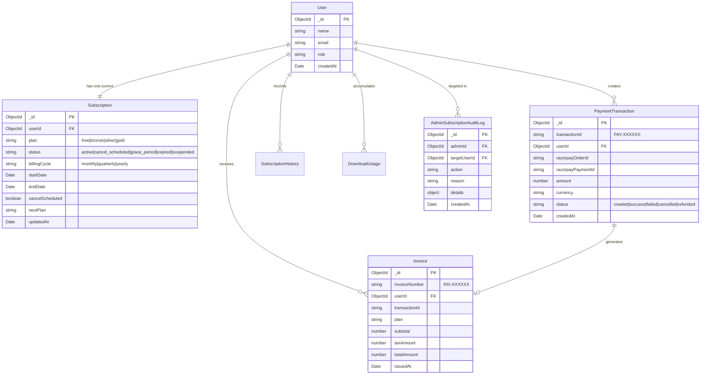

# Database Schema & Data Architecture Reference

This document outlines the MongoDB data schemas, field types, relationships, compound indexes, and retention policies powering the Subscription Management System.

---

## 1. Entity Relationship Diagram (ERD)



---

## 2. Collection Schemas

### 1. `subscriptions` Collection
* Stores the current entitlement state of a user.
* Primary Key: `_id` (ObjectId)
* References: `userId` $\rightarrow$ `users._id` (Unique 1:1)
* Fields:
  - `userId`: ObjectId, Required, Unique
  - `plan`: String, Enum: `["free", "bronze", "silver", "gold"]`, Default: `"free"`
  - `status`: String, Enum: `["active", "cancel_scheduled", "downgrade_scheduled", "grace_period", "expired", "suspended"]`
  - `billingCycle`: String, Enum: `["monthly", "quarterly", "yearly"]`, Default: `"monthly"`
  - `startDate`: Date
  - `endDate`: Date
  - `cancelScheduled`: Boolean, Default: `false`
  - `nextPlan`: String (Target plan for scheduled downgrades)

### 2. `paymenttransactions` Collection
* Stores every monetary checkout attempt and gateway response.
* Fields:
  - `transactionId`: String, Unique (Format: `PAY-YYYYMMDD-XXXXXX`)
  - `userId`: ObjectId, Required
  - `razorpayOrderId`: String, Indexed
  - `razorpayPaymentId`: String, Sparse Indexed
  - `amount`: Number (in INR)
  - `currency`: String, Default: `"INR"`
  - `status`: String, Enum: `["created", "success", "failed", "cancelled", "refunded"]`
  - `errorMessage`: String (Recorded if payment failed)
  - `createdAt`: Date

### 3. `invoices` Collection
* Tax-compliant invoice records.
* Fields:
  - `invoiceNumber`: String, Unique (Format: `INV-YYYYMM-XXXXXX`)
  - `userId`: ObjectId, Required
  - `transactionId`: String, Required
  - `plan`: String
  - `subtotal`: Number
  - `taxAmount`: Number (18% GST)
  - `totalAmount`: Number
  - `pdfBuffer`: Buffer (Optional compiled binary)
  - `issuedAt`: Date

### 4. `adminsubscriptionauditlogs` Collection
* Immutable record of back-office modifications.
* Fields:
  - `adminId`: ObjectId, Required
  - `targetUserId`: ObjectId, Required
  - `action`: String, Enum: `["override_plan", "extend_validity", "suspend_subscription", "restore_subscription", "process_refund"]`
  - `reason`: String, Required (min 5 characters)
  - `details`: Mixed Object
  - `createdAt`: Date

---

## 3. Database Indexes

```javascript
// High-frequency subscription lookups
SubscriptionSchema.index({ userId: 1 }, { unique: true });
SubscriptionSchema.index({ status: 1, endDate: 1 });

// Payment reconciliation & idempotency
PaymentTransactionSchema.index({ razorpayOrderId: 1 }, { unique: true, sparse: true });
PaymentTransactionSchema.index({ userId: 1, createdAt: -1 });

// Fast invoice retrieval
InvoiceSchema.index({ userId: 1, issuedAt: -1 });
InvoiceSchema.index({ invoiceNumber: 1 }, { unique: true });

// Admin audit queries
AdminSubscriptionAuditLogSchema.index({ targetUserId: 1, createdAt: -1 });
AdminSubscriptionAuditLogSchema.index({ adminId: 1, createdAt: -1 });
```

---

## 4. Retention & Archival Policies

1. **Active Subscriptions**: Kept indefinitely; updated on state transitions.
2. **Payment Transactions**: Retained for a minimum of 7 years to satisfy statutory tax compliance.
3. **Invoices**: Stored permanently; PDF documents generated deterministically or archived in cold storage (S3 Glacier).
4. **Audit Logs**: Immutable; deletion or mutation blocked at the database and application layers.
