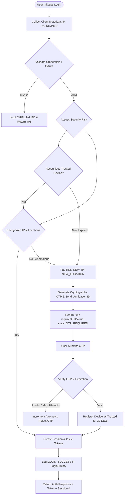

# Authentication System Analysis & Security Architecture (Phase 1)

## 1. Executive Summary & Objective

This document establishes the architectural foundation and system blueprint for the upcoming multi-phase security, device tracking, OTP verification, session management, and personalized user experience initiatives on the video platform.

### Strategic Goals:
1. **Analyze Existing Auth Flow**: Fully inspect the working authentication, tokens, sessions, database models, and frontend integration without breaking existing functionality.
2. **Preserve Compatibility**: Guarantee zero regression for existing Google OAuth, Firebase, and `/user/login` routes.
3. **Design Scalable Security Architecture**: Prepare modular schemas, service layers, security state machines, and event taxonomies for Phases 2–10.
4. **Define Theme Architecture**: Formulate time-based automatic switching (IST 5:00 AM–11:59 AM = Light, otherwise = Dark) alongside persistent manual overrides.
5. **Enforce Zero-Premature Execution**: Strictly avoid partial or premature implementation of external tracking, SMS/email gateways, or fingerprinting until their designated phases.

---

## 2. Existing Authentication & Infrastructure Analysis

### 2.1 Frontend Authentication Architecture

* **Framework & Core**: Next.js 16 (Pages router), React 19, TypeScript, Tailwind CSS v4.
* **Authentication Context** (`src/lib/AuthContext.js`):
  * Manages global state: `currentUser`, `user`, `token`, `loading`.
  * **Login Mechanism**: Initiates via Firebase Google Popup (`signInWithPopup(auth, provider)`). Obtains OAuth ID token and user metadata (name, email, avatar).
  * **Backend Handshake**: Posts to `/user/login` (or `/api/auth/login`) with `{ email, name, image }`. Receives signed backend JWT + normalized user object.
  * **Local Persistence**: Stores `{ user, token, Profile }` in browser `localStorage`.
  * **Auto-Rehydration & Session Restoration**:
    1. Reads `user` / `Profile` and `token` from `localStorage` on initial mount.
    2. If token is absent or `demo-token`, exchanges credentials against `/user/login`.
    3. Fetches fresh channel metadata via `GET /user/channel/:id`.
    4. If storage is empty, gracefully rehydrates default/existing user from `/user/getAllChanels`.
  * **Logout Mechanism**: Calls Firebase `signOut(auth)`, purges `localStorage`, and clears context state.
* **API Client & Request Interceptors**:
  * `src/lib/axiosinstance.js` & `src/services/apiClient.ts` attach `Authorization: Bearer <token>` on all outgoing HTTP requests.
* **UI Integration**:
  * `src/components/Header.tsx` displays the user avatar or "Sign in" button.
  * Dropdown menu gives access to "Your channel", "Downloads", "My Subscription", "Settings", and "Sign out".
* **Theme Baseline**:
  * `src/styles/globals.css` defines CSS variables:
    ```css
    :root {
      --background: #ffffff;
      --foreground: #171717;
    }
    @media (prefers-color-scheme: dark) {
      :root {
        --background: #0a0a0a;
        --foreground: #ededed;
      }
    }
    ```
  * Root wrapper `src/pages/_app.tsx` renders `<div className="min-h-screen bg-white text-neutral-900">`. Currently lacks a centralized `ThemeProvider` context for dynamic runtime switching.

---

### 2.2 Backend Authentication Architecture

* **Framework & Server**: Node.js, Express 4, Mongoose 8.
* **Auth Controller** (`server/controllers/auth.js`):
  * `POST /user/login`: Finds user by `email`. If user does not exist, registers new document with default channel details.
  * Generates session tracking via `createSession(existingUser._id, req)`.
  * Signs JWT using HMAC-SHA256 (`jwt.sign`) with payload:
    ```json
    {
      "email": "user@example.com",
      "id": "6a9a9b62dcecd22c98527df3",
      "sessionId": "4b6ec519-86e7-4972-bc2d-862d665fb66c"
    }
    ```
    Signed with `JWT_SECRET` (default 7-day expiration).
  * Returns user entity along with `token`.
* **Session & Security Controller** (`server/controllers/authSecurity.js`):
  * `createSession(userId, req)`: Generates UUID `sessionId`, resolves client IP and User-Agent, and persists in MongoDB `Session` collection.
  * `POST /api/auth/logout`: Revokes current active session by setting `revokedAt = new Date()`.
  * `GET /api/auth/sessions`: Lists active sessions for authenticated user.
  * `POST /api/auth/sessions/revoke`: Revokes a specific session by `sessionId`.
* **Authentication Middleware** (`server/middleware/authMiddleware.js`):
  * `requireAuth`: Extracts `Bearer <token>`, verifies signature with `authConfig.jwtSecret`, and checks `Session.findOne({ sessionId })` to enforce instant token revocation if `revokedAt != null`. Populates `req.user = { id, email, sessionId }`.
  * `optionalAuth`: Non-blocking authentication populating `req.user` if valid, otherwise `null`.
* **Password Hashing Status**:
  * The current primary authentication is OAuth-federated (Google / Firebase) and passwordless email identification.
  * Passwords are not currently stored in plain text or used in `/user/login`.
  * For future direct password/credential registration (Phases 6-7), standard `bcrypt` (12 rounds) or `argon2id` is specified in this architecture.

---

### 2.3 Existing Database Models Audit

| Model | Collection | Primary Fields | Security Reusability |
| :--- | :--- | :--- | :--- |
| `User` (`Auth.js`) | `users` | `name`, `channelname`, `description`, `email`, `image`, `joinedon`, `role`, `status` | Ready for non-breaking extension: `themeMode`, `themePreference`, `lastLoginAt`, `securitySettings` |
| `Session` (`Session.js`) | `sessions` | `sessionId`, `userId`, `userAgent`, `ip`, `lastActiveAt`, `expiresAt`, `revokedAt` | Fully compatible with Session Management (Phase 9); virtual `isActive` already present |
| `Device` (`Device.js`) | `devices` | `userId`, `device_identifier`, `device_name`, `device_type`, `browser`, `operating_system`, `user_agent`, `first_seen_at`, `last_seen_at`, `is_trusted`, `status` | Foundation already built in Phase 10/11; fully reusable for Phase 4 & Phase 8 |
| `SecurityEvent` (`SecurityEvent.js`) | `securityevents` | `eventType`, `userId`, `severity`, `ip`, `metadata`, `timestamp` | Reusable event log sink for auth security audits |

---

## 3. Modular Security Architecture & Directory Structure

To maintain separation of concerns, the backend security architecture is organized into distinct, reusable modules:

```text
server/
├── config/
│   └── index.js                      # Centralized configuration (JWT, OTP, Session, Device)
├── controllers/
│   ├── auth.js                       # Primary authentication (login, channel metadata)
│   ├── authSecurity.js               # Session revocation, active sessions
│   ├── securityController.js         # Security settings, risk evaluation (Future)
│   └── otpController.js              # OTP generation & validation endpoints (Future)
├── middleware/
│   ├── authMiddleware.js             # Bearer JWT verification & session revocation check
│   ├── securityMiddleware.js         # Rate limiting, risk analysis hook
│   └── validateRequest.js            # Input validation & schema sanitization
├── Modals/
│   ├── Auth.js                       # User entity (extended for preferences & security)
│   ├── Session.js                    # UserSession entity
│   ├── Device.js                     # Device & TrustedDevice entity
│   ├── LoginHistory.js               # Audit log for every authentication attempt
│   ├── OTPVerification.js            # Temporary OTP codes with expiry and rate limits
│   └── SecurityEvent.js              # Platform-wide security telemetry
├── services/
│   ├── authService.js                # Core login, token creation, password verification
│   ├── deviceService.js              # UA parsing, device fingerprinting, trust management
│   ├── sessionService.js             # Session lifecycle, multi-device logout
│   ├── otpService.js                 # Cryptographic OTP generation, hashing, rate limiting
│   ├── locationService.js            # IP anonymization & geo-resolution
│   ├── securityAuditService.js       # Security event dispatching
│   └── themePreferenceService.js     # User theme persistence & IST calculation
└── utils/
    ├── apiResponse.js                # Standardized JSON response envelopes
    ├── apiError.js                   # Typed HTTP error constructors
    └── ipUtils.js                    # IP extraction & HMAC-SHA256 masking
```

---

## 4. Scalable Data Models Specification

### 4.1 `User` Entity Extensions (Non-breaking)
```javascript
// Additive fields to server/Modals/Auth.js
{
  // Theme Preferences (Phases 2 & 3)
  themeMode: {
    type: String,
    enum: ["automatic", "light", "dark", "system"],
    default: "automatic"
  },
  themePreference: {
    type: String,
    enum: ["light", "dark", "system"],
    default: "dark"
  },
  lastThemeUpdatedAt: { type: Date, default: null },

  // Security & Verification (Phases 4 - 8)
  emailVerified: { type: Boolean, default: false },
  phone: { type: String, default: null },
  phoneVerified: { type: Boolean, default: false },
  lastLoginAt: { type: Date, default: null },
  lastLoginIP: { type: String, default: null },
  lastLoginLocation: {
    city: { type: String, default: null },
    country: { type: String, default: null }
  },
  securitySettings: {
    twoFactorEnabled: { type: Boolean, default: false },
    twoFactorMethod: { type: String, enum: ["email", "sms"], default: "email" },
    notifyNewDevice: { type: Boolean, default: true }
  }
}
```

### 4.2 `LoginHistory` Entity (Phase 9)
```javascript
// server/Modals/LoginHistory.js
const loginHistorySchema = new mongoose.Schema({
  userId: { type: mongoose.Schema.Types.ObjectId, ref: "User", required: true, index: true },
  sessionId: { type: String, default: null, index: true },
  deviceId: { type: String, required: true, index: true },
  deviceName: { type: String, default: "Web Browser" },
  browser: { type: String, default: "Unknown Browser" },
  operatingSystem: { type: String, default: "Unknown OS" },
  deviceType: { type: String, enum: ["desktop", "mobile", "tablet", "unknown"], default: "desktop" },
  ipAddress: { type: String, required: true },
  location: {
    city: { type: String, default: "Unknown" },
    region: { type: String, default: "Unknown" },
    country: { type: String, default: "Unknown" },
    approximate: { type: Boolean, default: true }
  },
  status: {
    type: String,
    enum: ["SUCCESS", "FAILED", "CHALLENGED", "BLOCKED"],
    required: true,
    index: true
  },
  riskScore: { type: Number, default: 0 },
  riskFactors: [{ type: String }],
  failureReason: { type: String, default: null },
  timestamp: { type: Date, default: Date.now, index: true }
}, { timestamps: true });
```

### 4.3 `TrustedDevice` Entity (Phase 8)
```javascript
// Extends or aliases server/Modals/Device.js
const trustedDeviceSchema = new mongoose.Schema({
  userId: { type: mongoose.Schema.Types.ObjectId, ref: "User", required: true, index: true },
  deviceIdentifier: { type: String, required: true, index: true },
  deviceName: { type: String, default: "Web Browser" },
  deviceType: { type: String, enum: ["desktop", "mobile", "tablet", "unknown"], default: "desktop" },
  browser: { type: String, default: "Unknown Browser" },
  operatingSystem: { type: String, default: "Unknown OS" },
  userAgent: { type: String, default: "" },
  lastIpAddress: { type: String, default: "" },
  isTrusted: { type: Boolean, default: true },
  trustedAt: { type: Date, default: Date.now },
  expiresAt: { type: Date, required: true, index: true }, // e.g., 30 days
  lastUsedAt: { type: Date, default: Date.now },
  status: { type: String, enum: ["active", "revoked", "expired"], default: "active", index: true }
}, { timestamps: true });
```

### 4.4 `UserSession` Entity (Phase 9)
```javascript
// Matches server/Modals/Session.js
const sessionSchema = new mongoose.Schema({
  sessionId: { type: String, required: true, unique: true, index: true },
  userId: { type: mongoose.Schema.Types.ObjectId, ref: "User", required: true, index: true },
  deviceId: { type: String, default: "device_web_default", index: true },
  userAgent: { type: String, default: "Web Browser" },
  ip: { type: String, default: "127.0.0.1" },
  location: {
    city: { type: String, default: null },
    country: { type: String, default: null }
  },
  lastActiveAt: { type: Date, default: Date.now },
  expiresAt: { type: Date, required: true, index: true },
  revokedAt: { type: Date, default: null, index: true }
}, { timestamps: true });
```

### 4.5 `OTPVerification` Entity (Phase 7)
```javascript
// server/Modals/OTPVerification.js
const otpVerificationSchema = new mongoose.Schema({
  verificationId: { type: String, required: true, unique: true, index: true },
  userId: { type: mongoose.Schema.Types.ObjectId, ref: "User", required: true, index: true },
  purpose: { type: String, enum: ["LOGIN_CHALLENGE", "DEVICE_TRUST", "EMAIL_VERIFY"], required: true },
  recipient: { type: String, required: true }, // masked email or phone
  channel: { type: String, enum: ["email", "sms"], required: true },
  hashedOtp: { type: String, required: true }, // SHA-256(otp + salt)
  salt: { type: String, required: true },
  attempts: { type: Number, default: 0 },
  maxAttempts: { type: Number, default: 5 },
  expiresAt: { type: Date, required: true, index: true }, // e.g. 10 minutes
  verifiedAt: { type: Date, default: null },
  status: { type: String, enum: ["pending", "verified", "expired", "exhausted"], default: "pending" }
}, { timestamps: true });
```

---

## 5. Security Flows & State Machine

### 5.1 End-to-End Authentication & Risk Flow



### 5.2 Login Security States Definition

Both frontend and backend adhere to a finite set of authentication states:

| State Code | Description | Client Action |
| :--- | :--- | :--- |
| `IDLE` | No active login operation in progress | Display standard login trigger |
| `LOGIN_LOADING` | Submitting credentials / OAuth handshake | Display loading indicator |
| `SECURITY_CHECK` | Backend evaluating device risk, IP, and location | Non-blocking backend step |
| `OTP_REQUIRED` | New device/IP detected; challenge issued | Transition UI to OTP input modal |
| `OTP_VERIFYING` | Validating user-submitted OTP code | Disable OTP submit & show spinner |
| `OTP_VERIFIED` | OTP accepted by security service | Transition to session creation |
| `SESSION_CREATED` | Database session generated & bound to token | Persist tokens in storage/cookies |
| `LOGIN_SUCCESS` | Authentication fully completed | Update user context & redirect |
| `LOGIN_FAILED` | Invalid credentials or exhausted OTP attempts | Display user-friendly error message |

---

## 6. Standardized API Response Envelopes & Error Taxonomy

Authentication and security APIs adhere strictly to standardized envelope schemas to ensure contract consistency across web, mobile, and third-party consumers.

### 6.1 Success Envelope
```json
{
  "success": true,
  "message": "Login successful",
  "data": {
    "user": {
      "_id": "6a9a9b62dcecd22c98527df3",
      "name": "Kundan",
      "email": "kundank82522@gmail.com",
      "themePreference": "dark",
      "themeMode": "automatic"
    },
    "token": "eyJhbGciOiJIUzI1NiIsInR5cCI6IkpXVCJ9...",
    "sessionId": "4b6ec519-86e7-4972-bc2d-862d665fb66c"
  }
}
```

### 6.2 Challenge Envelope (OTP Required)
```json
{
  "success": false,
  "requiresOTP": true,
  "verificationId": "v-87c2b534-7a1a-4d76-92b0",
  "channel": "email",
  "maskedRecipient": "k***2@gmail.com",
  "message": "New device detected. Additional verification required.",
  "error": {
    "code": "OTP_REQUIRED",
    "message": "Security verification required for unrecognized device"
  }
}
```

### 6.3 Standard Error Codes Reference

| Error Code | HTTP Status | Description |
| :--- | :---: | :--- |
| `INVALID_CREDENTIALS` | 401 | Email/password or OAuth token mismatch |
| `OTP_REQUIRED` | 200/403 | Challenge issued due to new device, IP, or location |
| `OTP_INVALID` | 400 | Incorrect verification code entered |
| `OTP_EXPIRED` | 410 | OTP exceeded configured validity window (e.g. 10m) |
| `OTP_MAX_ATTEMPTS_EXCEEDED` | 429 | Exceeded 5 verification attempts; code invalidated |
| `DEVICE_NOT_TRUSTED` | 403 | Device signature unrecognized or revoked |
| `DEVICE_LIMIT_REACHED` | 403 | Account has reached maximum allowed active devices |
| `SESSION_EXPIRED` | 401 | Session timestamp exceeded max lifetime |
| `SESSION_REVOKED` | 401 | Session explicitly revoked by user or security action |
| `SESSION_NOT_FOUND` | 404 | Session identifier does not exist |
| `UNAUTHORIZED` | 401 | Missing or malformed Bearer authorization header |
| `SECURITY_VERIFICATION_REQUIRED` | 403 | High-risk action blocked pending multi-factor confirmation |

---

## 7. Security Event Taxonomy

Platform security events are dispatched through `server/Modals/SecurityEvent.js` to build an immutable audit trail:

| Event Type | Severity | Description |
| :--- | :---: | :--- |
| `LOGIN_ATTEMPT` | `INFO` | Initial credential or token submission |
| `LOGIN_SUCCESS` | `INFO` | Successful login and session initialization |
| `LOGIN_FAILED` | `WARN` | Failed attempt (bad credentials, blocked account) |
| `NEW_DEVICE_DETECTED` | `WARN` | Unrecognized device fingerprint attempting login |
| `NEW_BROWSER_DETECTED` | `INFO` | Recognized device using a newly observed browser |
| `NEW_IP_DETECTED` | `INFO` | Login from an IP address not previously logged |
| `NEW_LOCATION_DETECTED` | `WARN` | Login from a geographic city/country not previously logged |
| `OTP_SENT` | `INFO` | Verification challenge dispatched via email or SMS |
| `OTP_VERIFIED` | `INFO` | Correct code provided; challenge cleared |
| `OTP_FAILED` | `WARN` | Incorrect OTP entered by user |
| `DEVICE_TRUSTED` | `INFO` | Device added to trusted roster for 30 days |
| `DEVICE_REMOVED` | `INFO` | Device untrusted or revoked by user |
| `SESSION_CREATED` | `INFO` | New active session record created |
| `SESSION_TERMINATED` | `INFO` | Explicit logout or individual session revocation |

*Confidentiality Guarantee*: Metadata never includes plain passwords, raw OTP secrets, JWT private keys, or full unmasked authorization headers.

---

## 8. Theme System Architecture Specification

The system architecture specifies a seamless dual-tier theme engine for Phase 2 & 3:

```text
User Visit / Login
  ↓
Check Saved User Preference (Database / LocalStorage)
  ↓
Manual Preference Set? (mode === "light" | "dark" | "system")
  ↓
  YES ───────────────> Apply Manual Theme Override
  ↓
  NO (mode === "automatic")
  ↓
Resolve Indian Standard Time (IST, UTC+5:30):
  Hour >= 5 and Hour < 12 (5:00 AM - 11:59 AM IST)
  ↓
  YES ───────────────> Apply LIGHT Theme
  NO  ───────────────> Apply DARK Theme
```

### Key Technical Properties:
1. **IST Time Resolution**: Computed using `Intl.DateTimeFormat("en-US", { timeZone: "Asia/Kolkata", hour: "numeric", hour12: false })` or UTC offset math. Independent of client system clock manipulation.
2. **Precedence**: An explicit user selection (`themeMode: "light"` or `themeMode: "dark"`) overrides the automatic schedule permanently until the user chooses "Automatic" again.
3. **FOUC Prevention**: Future Phase 2 will inject an inline hydration script before document body execution to eliminate light/dark flashes.

---

## 9. Environment Variables Configuration

The environment configuration has been reviewed and standardized in `server/.env.example`:

| Variable | Default / Example | Purpose |
| :--- | :--- | :--- |
| `JWT_SECRET` | Secure string (min 32 chars) | HMAC-SHA256 signing secret for access tokens |
| `JWT_EXPIRES_IN` | `7d` | Token lifetime |
| `REFRESH_TOKEN_SECRET` | Secure string | Long-lived refresh token secret (Future) |
| `REFRESH_TOKEN_EXPIRES_IN` | `30d` | Refresh token lifetime (Future) |
| `OTP_EXPIRY_MINUTES` | `10` | Lifetime of temporary verification codes |
| `OTP_MAX_ATTEMPTS` | `5` | Maximum entry retries before OTP voiding |
| `OTP_RATE_LIMIT_WINDOW_MINUTES` | `15` | Window for throttling OTP dispatches |
| `OTP_MAX_REQUESTS_PER_WINDOW` | `3` | Maximum challenges generated per window |
| `TRUSTED_DEVICE_EXPIRY_DAYS` | `30` | Duration a device remains trusted without OTP |
| `SESSION_EXPIRY_DAYS` | `7` | Active session lifetime before mandatory re-auth |
| `MAX_ACTIVE_SESSIONS_PER_USER` | `10` | Ceiling on concurrent sessions per account |
| `EMAIL_SERVICE` | `mock` (`sendgrid`, `ses`) | Email delivery provider for OTP dispatches |
| `SMS_SERVICE` | `mock` (`twilio`) | SMS gateway for phone verification |
| `APP_TIMEZONE` | `Asia/Kolkata` | Canonical timezone for automatic theme calculation |

---

## 10. Verification of Non-Breaking Compatibility

All existing functional paths remain active and unaffected:
* Existing `/user/login` and `/api/auth/login` continue to authenticate existing users and return `{ ...user, token, result }` shape.
* Existing Firebase OAuth popup and fallback login routines operate without disruption.
* `requireAuth` middleware retains full compatibility with existing JWT tokens and session tracking.
* No premature background jobs, geolocators, or external SMS services have been activated in this phase.
