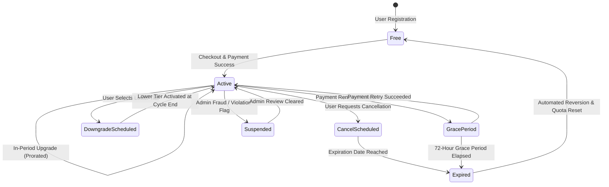

# Subscription Lifecycle & State Machine Guide

This technical guide outlines the full state machine, transitions, business rules, and background cron processing governing user subscriptions across the platform.

---

## 1. Subscription State Machine Overview

The platform uses a formal finite-state machine (FSM) to handle all subscription lifecycle phases reliably without race conditions:

---

## 2. Supported Subscription States

| State | Description | Feature Access | In-App Messaging |
| :--- | :--- | :---: | :--- |
| `free` | Default un-billed tier assigned upon signup. | Standard | Upgrade banners shown on premium content. |
| `active` | Active paid membership (`bronze`, `silver`, `gold`). | Fully Unlocked | Full access badge, renews automatically. |
| `cancel_scheduled` | User cancelled renewal; active until `endDate`. | Fully Unlocked | Banner: "Your plan will cancel on [Date]. Resubscribe anytime." |
| `downgrade_scheduled`| User scheduled downgrade at end of current cycle. | Highest Tier | Banner: "Your plan will switch to [Tier] on [Date]." |
| `grace_period` | Renewal payment failed; 3-day recovery window. | Fully Unlocked | Alert: "Payment failed. Please update method within 3 days." |
| `expired` | Paid term ended and grace period lapsed. | Reverted to Free| Modal: "Your subscription has expired. Explore our plans." |
| `suspended` | Administrative freeze due to chargeback or fraud. | Locked to Free | Warning: "Subscription suspended. Contact support." |

---

## 3. Subscription Transition Rules & Edge Cases

### Transition 1: Free to Active (New Subscription)
* **Trigger**: Payment signature verification (`POST /api/subscriptions/verify-payment`) or Razorpay webhook (`payment.captured`, `order.paid`).
* **Validation**:
  - Validates order ID and cryptographic signature (`HMAC_SHA256(orderId + "|" + paymentId, secret)`).
  - Verifies payment status in `PaymentTransaction` collection to prevent replay attacks.
* **State Updates**:
  - `Subscription.status` $\rightarrow$ `active`
  - `Subscription.plan` $\rightarrow$ `requestedPlan`
  - `Subscription.startDate` $\rightarrow$ `now`
  - `Subscription.endDate` $\rightarrow$ `now + interval` (30 days for monthly, 90 days for quarterly, 365 days for yearly)
  - `SubscriptionHistory` record created with action `subscription_activated`.
  - Tax-compliant PDF invoice created and email notification dispatched.

### Transition 2: In-Period Upgrades (e.g. Silver to Gold)
* **Immediate Tier Elevation**: Gold features (4K streaming, 50 daily downloads) take effect immediately upon payment confirmation.
* **Validity Adjustment**: The new expiration date is calculated from the upgrade timestamp.
* **Audit Trail**: Recorded in `SubscriptionHistory` with action `plan_upgraded`.

### Transition 3: Scheduled Downgrades
* To prevent forfeiture of already-paid entitlements, downgrades are scheduled for the end of the current billing cycle.
* Flag `downgradeScheduled: true` and `nextPlan: targetPlan` stored on subscription record.
* Quota and access rules remain at the higher tier until `endDate`.

### Transition 4: Cancellations
* Cancellation does **not** forfeit remaining days.
* Status transitions to `cancel_scheduled`.
* Automatic recurring billing is deactivated at the payment gateway.
* Access privileges remain active until `endDate`.

### Transition 5: Automated Expiry & Downgrade to Free
* Handled continuously by the background cron worker (`cron/subscriptionCron.js`).
* Identifies all subscriptions where `endDate <= now` and status is `active`, `cancel_scheduled`, or `grace_period`.
* Automatically demotes status to `expired`, resets plan to `free`, and scales daily download limit to `1`.
* Dispatches email informing the user that their plan has concluded.

---

## 4. Background Cron Job Architecture

The subscription management system includes 4 automated cron jobs:

1. **Hourly Expiration Worker** (`0 * * * *`):
   - Scans for lapsed subscriptions past their end date.
   - Executes safe downgrades to Free.
2. **Daily Grace Period Monitor** (`0 2 * * *`):
   - Identifies payment retry attempts for accounts in `grace_period`.
   - Expires accounts exceeding the 72-hour window.
3. **Daily Renewal Reminder Worker** (`0 8 * * *`):
   - Identifies subscriptions expiring in exactly 3 days and 1 day.
   - Dispatches transactional renewal reminder emails with one-click renewal links.
4. **Midnight Quota Reset Worker** (`0 0 * * *` UTC):
   - Resets daily download usage and daily streaming timers across all users.
