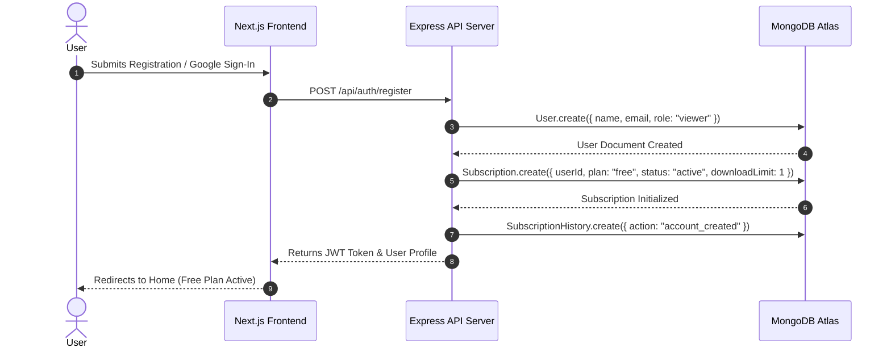
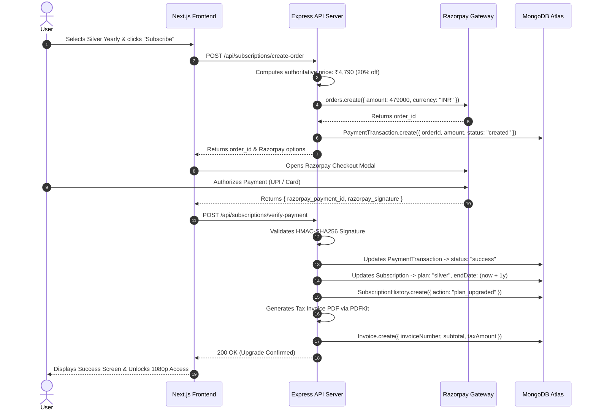
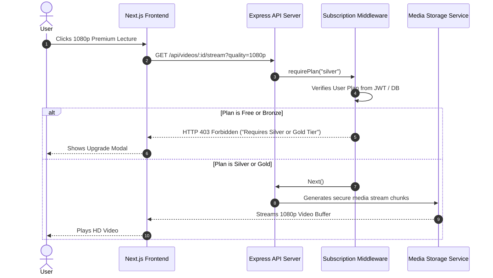
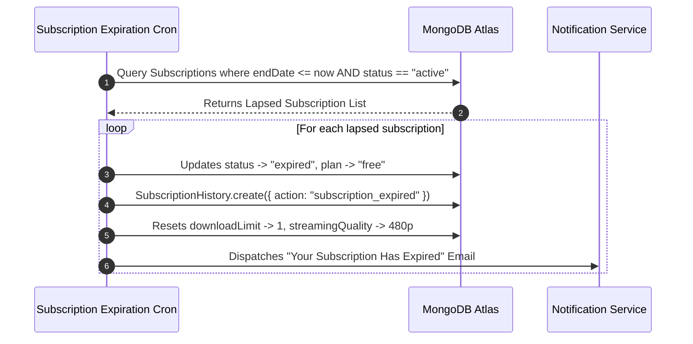

# End-to-End System Flows & Architectural Sequence Diagrams

This document illustrates the critical data flows and user journeys across the Subscription Management System using Mermaid sequence diagrams.

---

## 1. User Registration to Free Tier Flow

---

## 2. Plan Upgrade & Payment Verification Flow

---

## 3. Premium Video Streaming Access Control Flow

---

## 4. Automated Subscription Expiration & Demotion Flow

